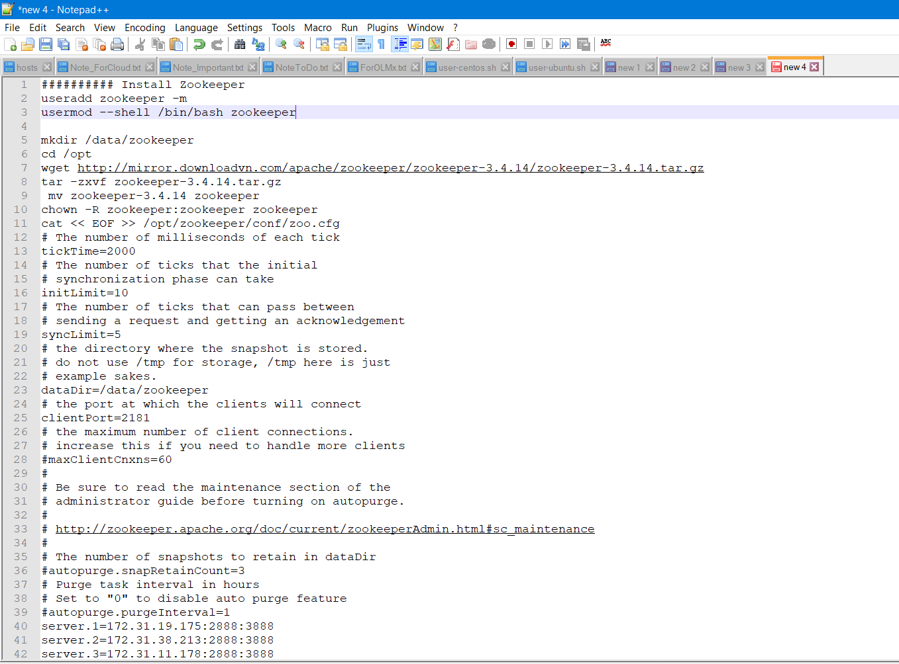
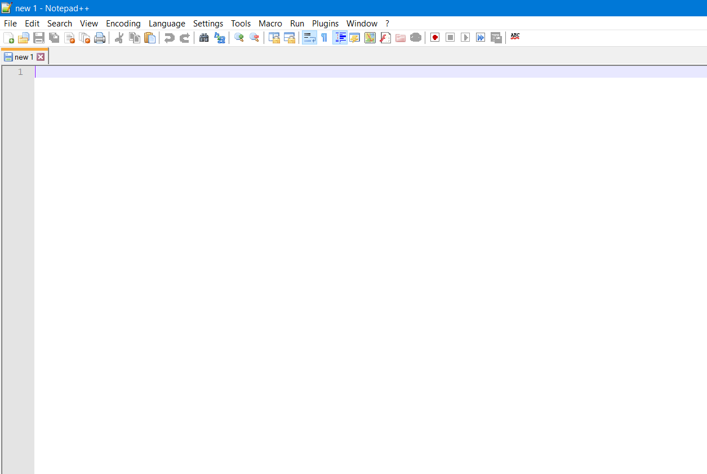

# Tips khôi phục lại các file đang mở của Notepad++ trong trường hợp bị crash, hoặc khôi phục trạng thái các file đang mở sau khi update.  

​	Mình có thói quen dùng Notepad++ để lưu tạm, hoặc lưu các thông tin trong quá trình cài đặt, thông số cấu hình, thông tin account của server hoặc một số service mà không được phép public (nhưng lại dùng để login hàng ngày nên muốn luôn mở trong Notepad++, lúc dùng copy paste bụp phát là xong 😁), hoặc dùng đúng chức năng của nó là edit các file.

Với mục đích trên thì những file thông tin tài khoản cần thiết lúc nào mình cũng để mở ở Notepad++, mỗi ngày khi tới làm chỉ cần mở Notepad++ lên là các file đó sẵn ở đó cho mình dùng luôn mà mình không phải mất công đi vào path từng file và open nó lên. Như việc mở sẵn file hosts ở đó, lúc nào cần add một số domain để test mình chỉ cần sửa luôn mà không mất công đi tìm lại location của file hosts nữa. Và trong quá trình làm việc trong ngày, một số thông tin mình sẽ muốn lưu tạm lại (tức là không hẳn muốn nó save thành file, mà chỉ lưu tạm ở các tab Newxxx gì đó thôi): các câu lệnh chạy trong quá trình setup gì đó, thông tin output các lệnh, một số password tạo cho người dùng không muốn lưu lại mà cũng chưa muốn xóa ngay để phòng hôm sau dùng tới, hay khi đang viết dỡ tài liệu, cuối ngày chưa xong, nhưng cũng chưa thể publish lên nơi cần lưu trữ, các dữ liệu cần lưu trong khoảng 1 ngày, vài ngày tới 1 tuần cho tới khi mình xử lý các dữ liệu đó, lưu lại ở 1 file nào đó mà đã viết lại một cách rành mạch. Nói chung là, việc dùng Notepad++ theo cách trên rất tiện với mình.Kiểu như này nè:



**NHƯNG** .. mình gặp phải tình huống khá oái oăm là đôi khi, Notepad++ khi bật lên sẽ hiện popup hỏi ý kiến về việc update version mới, sau nhiều nhiều lần say no thì cuối cùng, nó sẽ tự update dù mình có click no =) Sau quá trình đó là toàn bộ các file đã lưu rồi - mình mở sẵn ra để dùng và các file Newxxx lưu tạm của mình đều fly color 😣Hiển thị trước mắt mình là màn hình tab New1 mới trắng tinh hong tì vết kiểu như này:



Khá là **CÁU ლ( `Д’** **ლ)** bao nhiêu công mở các file hay dùng, sắp xếp theo thứ tự mong muốn và một số file tạm đang dùng dở, bỗng reset lại về ban đầu.

Với kinh nghiệm làm system ít ỏi của mình, mình nghĩ là Notepad++ cũng là một ứng dụng thôi, cũng sẽ có phần cấu hình thông số và phần data của Notepad++. Như vậy thì mỗi lần mở lên, các file đang mở, và các file tạm của mình mới vẫn còn thông tin và show lên như đúng trạng thái trước khi mình tắt máy. Điều này thôi thúc mình lên mạng tra xem cơ chế hoạt động của nó ra sao, làm sao để mình có thể cứ giữ trạng thái các file đang mở, các file tạm của mình sau khi update.

Và PING.. tìm được link này nói về các cấu hình hoạt động khá ổn: https://tompai.pro/computers/solutions-remove-last-file-from-notepad-startup/

Mình bắt đầu theo system với linux và mã nguồn mở, nên các app và cấu hình của windows khá là mù mờ :v may được cái win nó cũng hoạt động kiểu có phần config và phần data của app. hehe. Mò ra link trên + đọc thêm một số link khác với key word: **recovery file tmp notepad++** và **file cache notepad++** thì mình rút ra được một vài ý hay ho như sau:

- Data và config của Notepad++ được lưu trong thư mục: `**C:\Users\\AppData\Roaming\Notepad++**` . Trong đó các file     đang mở của mình trên Notepad++ được backup định kì 10s 1 lần vào     thư mục : **C:\Users\\AppData\Roaming\Notepad++\backup**

- File **C:\Users\\AppData\Roaming\Notepad++\session.xml** để lưu các metadata các     file đang mở của Notepad++ trước lúc nó bị tắt đi. Nội dung kiểu như sau:

```visual basic
<NotepadPlus>
    <Session activeView="0">
        <mainView activeIndex="10">
            <File firstVisibleLine="0" xOffset="0" scrollWidth="5159" startPos="0" endPos="0" selMode="0" lang="Normal Text" encoding="-1" filename="C:\Windows\System32\drivers\etc\hosts" backupFilePath="" originalFileLastModifTimestamp="-1326012074" originalFileLastModifTimestampHigh="30761488" mapFirstVisibleDisplayLine="-1" mapFirstVisibleDocLine="-1" mapLastVisibleDocLine="-1" mapNbLine="-1" mapHigherPos="-1" mapWidth="-1" mapHeight="-1" mapKByteInDoc="1143275520" mapWrapIndentMode="-1" mapIsWrap="no" />
            <File firstVisibleLine="0" xOffset="0" scrollWidth="5159" startPos="0" endPos="0" selMode="0" lang="Normal Text" encoding="-1" filename="D:\OneDrive\Ta&#x0300;i li&#x00EA;&#x0323;u\Note_ForCloud.txt" backupFilePath="" originalFileLastModifTimestamp="-92734198" originalFileLastModifTimestampHigh="30757287" mapFirstVisibleDisplayLine="-1" mapFirstVisibleDocLine="-1" mapLastVisibleDocLine="-1" mapNbLine="-1" mapHigherPos="-1" mapWidth="-1" mapHeight="-1" mapKByteInDoc="-875902520" mapWrapIndentMode="-1" mapIsWrap="no" />
            <File firstVisibleLine="0" xOffset="0" scrollWidth="5159" startPos="0" endPos="0" selMode="0" lang="Normal Text" encoding="-1" filename="D:\OneDrive\Ta&#x0300;i li&#x00EA;&#x0323;u\Note_Important.txt" backupFilePath="" originalFileLastModifTimestamp="-57584206" originalFileLastModifTimestampHigh="30761516" mapFirstVisibleDisplayLine="-1" mapFirstVisibleDocLine="-1" mapLastVisibleDocLine="-1" mapNbLine="-1" mapHigherPos="-1" mapWidth="-1" mapHeight="-1" mapKByteInDoc="7864439" mapWrapIndentMode="-1" mapIsWrap="no" />
            <File firstVisibleLine="0" xOffset="0" scrollWidth="5159" startPos="0" endPos="0" selMode="0" lang="Normal Text" encoding="-1" filename="D:\OneDrive\Ta&#x0300;i li&#x00EA;&#x0323;u\NoteToDo.txt" backupFilePath="" originalFileLastModifTimestamp="-150759370" originalFileLastModifTimestampHigh="30757287" mapFirstVisibleDisplayLine="-1" mapFirstVisibleDocLine="-1" mapLastVisibleDocLine="-1" mapNbLine="-1" mapHigherPos="-1" mapWidth="-1" mapHeight="-1" mapKByteInDoc="34603536" mapWrapIndentMode="-1" mapIsWrap="no" />
            <File firstVisibleLine="0" xOffset="0" scrollWidth="1474" startPos="0" endPos="0" selMode="0" lang="Normal Text" encoding="-1" filename="D:\OneDrive\Ta&#x0300;i li&#x00EA;&#x0323;u\ForOLMx.txt" backupFilePath="" originalFileLastModifTimestamp="-1374709191" originalFileLastModifTimestampHigh="30740221" mapFirstVisibleDisplayLine="-1" mapFirstVisibleDocLine="-1" mapLastVisibleDocLine="-1" mapNbLine="-1" mapHigherPos="-1" mapWidth="-1" mapHeight="-1" mapKByteInDoc="0" mapWrapIndentMode="-1" mapIsWrap="no" />
            <File firstVisibleLine="0" xOffset="0" scrollWidth="5159" startPos="28" endPos="28" selMode="0" lang="Shell" encoding="-1" filename="D:\OneDrive\Ta&#x0300;i li&#x00EA;&#x0323;u\user-centos.sh" backupFilePath="" originalFileLastModifTimestamp="570216706" originalFileLastModifTimestampHigh="30757303" mapFirstVisibleDisplayLine="-1" mapFirstVisibleDocLine="-1" mapLastVisibleDocLine="-1" mapNbLine="-1" mapHigherPos="-1" mapWidth="-1" mapHeight="-1" mapKByteInDoc="1143275520" mapWrapIndentMode="-1" mapIsWrap="no" />
            <File firstVisibleLine="0" xOffset="0" scrollWidth="5159" startPos="0" endPos="0" selMode="0" lang="Shell" encoding="-1" filename="D:\OneDrive\Ta&#x0300;i li&#x00EA;&#x0323;u\user-ubuntu.sh" backupFilePath="" originalFileLastModifTimestamp="1785336534" originalFileLastModifTimestampHigh="30752826" mapFirstVisibleDisplayLine="-1" mapFirstVisibleDocLine="-1" mapLastVisibleDocLine="-1" mapNbLine="-1" mapHigherPos="-1" mapWidth="-1" mapHeight="-1" mapKByteInDoc="116022776" mapWrapIndentMode="-1" mapIsWrap="no" />
            <File firstVisibleLine="92" xOffset="0" scrollWidth="5159" startPos="3988" endPos="3988" selMode="0" lang="Normal Text" encoding="-1" filename="new 1" backupFilePath="C:\Users\TamNTT4\AppData\Roaming\Notepad++\backup\new 1@2019-09-04_185417" originalFileLastModifTimestamp="0" originalFileLastModifTimestampHigh="0" mapFirstVisibleDisplayLine="-1" mapFirstVisibleDocLine="-1" mapLastVisibleDocLine="-1" mapNbLine="-1" mapHigherPos="-1" mapWidth="-1" mapHeight="-1" mapKByteInDoc="1143275520" mapWrapIndentMode="-1" mapIsWrap="no" />
            <File firstVisibleLine="58" xOffset="0" scrollWidth="5159" startPos="3126" endPos="3126" selMode="0" lang="Normal Text" encoding="-1" filename="new 2" backupFilePath="C:\Users\TamNTT4\AppData\Roaming\Notepad++\backup\new 2@2019-09-04_185439" originalFileLastModifTimestamp="0" originalFileLastModifTimestampHigh="0" mapFirstVisibleDisplayLine="-1" mapFirstVisibleDocLine="-1" mapLastVisibleDocLine="-1" mapNbLine="-1" mapHigherPos="-1" mapWidth="-1" mapHeight="-1" mapKByteInDoc="1143275520" mapWrapIndentMode="-1" mapIsWrap="no" />
            <File firstVisibleLine="31" xOffset="0" scrollWidth="5159" startPos="3684" endPos="3684" selMode="0" lang="Normal Text" encoding="-1" filename="new 3" backupFilePath="C:\Users\TamNTT4\AppData\Roaming\Notepad++\backup\new 3@2019-09-04_185500" originalFileLastModifTimestamp="0" originalFileLastModifTimestampHigh="0" mapFirstVisibleDisplayLine="-1" mapFirstVisibleDocLine="-1" mapLastVisibleDocLine="-1" mapNbLine="-1" mapHigherPos="-1" mapWidth="-1" mapHeight="-1" mapKByteInDoc="1143275520" mapWrapIndentMode="-1" mapIsWrap="no" />
            <File firstVisibleLine="0" xOffset="0" scrollWidth="5159" startPos="496" endPos="496" selMode="0" lang="Normal Text" encoding="-1" filename="new 4" backupFilePath="C:\Users\TamNTT4\AppData\Roaming\Notepad++\backup\new 4@2019-09-04_185549" originalFileLastModifTimestamp="0" originalFileLastModifTimestampHigh="0" mapFirstVisibleDisplayLine="-1" mapFirstVisibleDocLine="-1" mapLastVisibleDocLine="-1" mapNbLine="-1" mapHigherPos="-1" mapWidth="-1" mapHeight="-1" mapKByteInDoc="1143275520" mapWrapIndentMode="-1" mapIsWrap="no" />
        </mainView>
        <subView activeIndex="0" />
    </Session>
</NotepadPlus>
```

Nội dung của nó là sẽ mở các tab tới các file đã lưu rồi, các file mà chỉ lưu tạm sẽ có 1 bản backup trong thư mục **C:\Users\\AppData\Roaming\Notepad++\backup\\** và được đánh thêm thông tin timedate. Khi mình đóng cửa sổ của Notepad++, thông tin metadata các file đang mở ở phiên này sẽ lưu vào session.xml. Sau đó, lần sau khi Open app Notepad++, nó sẽ mở lên theo thứ tự và các file mà thông tin ở trong file **session.xml**.

Đấy, nó chỉ đơn giản như vại thôi :v Nên với case của mình, trước khi click yes or no khi popup update hiện lên mình sẽ lưu backup lại cái file **session.xml** này trước, để sau khi update nó có lỡ bị reset lại về ban đầu thì mình chỉ cần paste lại nội dung của nó trước khi nó update là mọi thứ sẽ trở lại nguyên vẹn như chưa từng mất. (à nhớ backup ra một ứng dụng note khác nhé, ví như notepad hoặc sublime text chẳng hạn, và lúc edit paste lại nội dung file session.xml thì cũng nhớ là không dùng Notepad++ nha, không nó lại lưu vào chính cái phiên làm việc hiện tại vào là lúc bật lại Notepad++ cũng không được như ý đâu. 😃

**(づ ￣ ³￣)づ**

(Móa =)) cái note cuồn còe này đã note lại từ hơn 1 năm trước ròi :v thời mỗi ngày đi làm là một ngày vui 😌)

#### Nguồn tham khảo

 https://tompai.pro/computers/solutions-remove-last-file-from-notepad-startup/